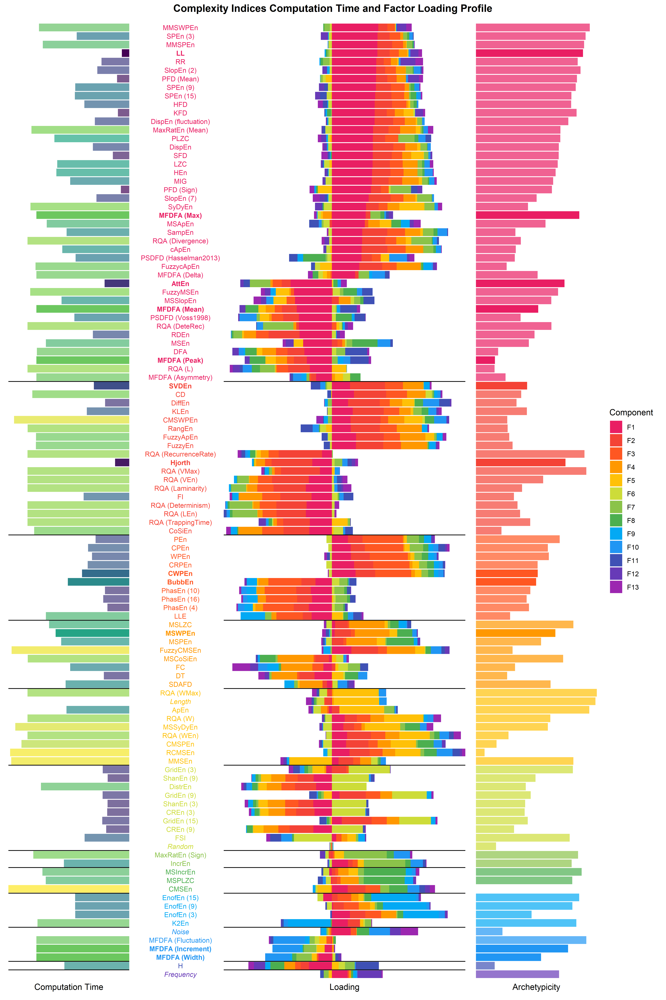

# The Structure of Chaos: An Empirical Comparison of Fractal Physiology Complexity Indices using NeuroKit2

- See the open-access [**preprint**](https://psyarxiv.com/v5tqw/).
- Data generation [**script**](make_data.py)
- Data analysis [**script**](analysis.Rmd)

## Abstract

Complexity quantification, through entropy, information theory and fractal dimension indices, is gaining a renewed traction in psychophsyiology, as new measures with promising qualities emerge from the computational and mathematical advances. Unfortunately, few studies compare the relationship and objective performance of the plethora of existing metrics, in turn hindering reproducibility, replicability, consistency, and clarity in the field. Using the NeuroKit2 Python software, we computed a list of 112 complexity indices on signals varying in their characteristics (noise, length and frequency spectrum). We then systematically compared the indices by their computational weight, their representativeness of a multidimensional space of latent dimensions, and empirical proximity with other indices. Based on these considerations, we propose that a selection of 12 indices, together representing 85.97\\% of the total variance of all indices, might offer a parsimonious and complimentary choice in regards to the quantification of the complexity of time series. Our selection includes *CWPEn*, *Line Length (LL)*, *BubbEn*, *MSWPEn*, *MFDFA (Max)*, *Hjorth Complexity*, *SVDEn*, *MFDFA (Width)*, *MFDFA (Mean)*, *MFDFA (Peak)*, *MFDFA (Fluctuation)*, *AttEn*. Elements of consideration for alternative subsets are discussed, and data, analysis scripts and code for the figures are open-source.

